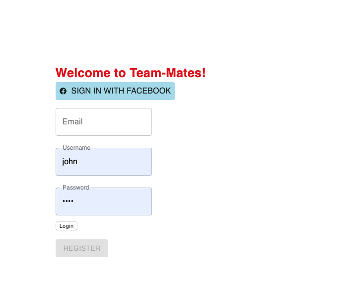

# Team-Mates

Deployed at: https://team-mates-meteor-app.herokuapp.com

Team-Mates: A web app that user can register to form teams. Users will be able to see all the registered teams and members, create new teams and update their information. The app is handy for party games, friends meetings, fun social events.

## Screenshots

- Register

- Profile

- Teams

## Author

- Tim Nguyen

## Installation Instructions

Install
`meteor npm install`

Front-End Development
`meteor`

Back-End Database
`meteor mongo`

## How To Use The App

First, create an account with Team-Mates or Sign In with Facebook Account. Once sign in is successful, the user will be taken to Home- Profile Page. To navigate to Teams Page or log out, click the profile icon on the top right corner.

## Data Structure

When user registers with the form or facebook, their info will be registered in MongoDB users collection. When user creates a new team with Team-Mates, info will be stored in MongoDB groups collection. groups Collection will store info regarding team's name and selected members. All selected members must have exisitng accounts with Team-Mates.

## What I found challenging

Overall, I feel satisfied with the functional requirements that I was able to do for the app. User can register/login, validation errors would display during the process. On the profile page, user can see their info, the teams they are in, and update their username. On the teams page, user can see all the available teams with the members of the teams. User can also create a new team with all the exisiting members of Team-Mates.

Editing was challenging as I could update the username but not the email. The email is registered as emails[0].address in MongoDB users. I tried to put that field in my Meteor update function but VSCode yielded a syntax error. I also tried to place that in a string, but the data failed to update.

Facebook Configuration was new to me and took a while. At the end, I was able to put everything together and let the user sign in with Facebook successfully.

## Future Considerations

User can edit the email. Add more fields to register form so that user can have more of their info displayed on Profile.

## Technologies Involved

Back-End Development

- MongoDB
- Meteor.JS
- Node.JS

Front-End Development

- React.JS
- Meteor.JS
- Material-UI
